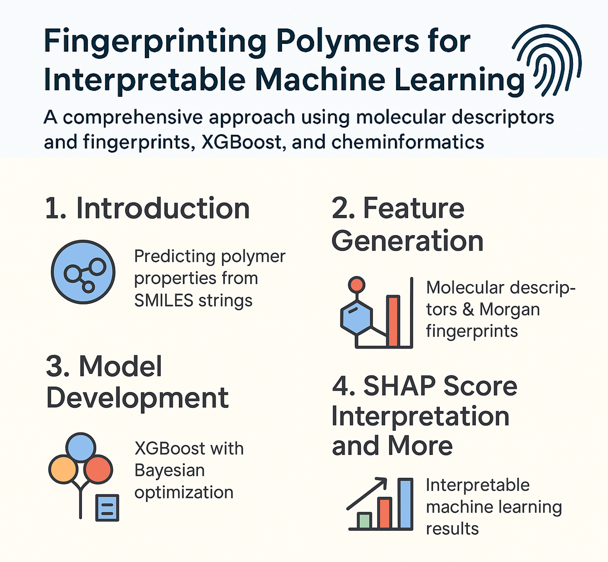

# NeurIPS_Open-Polymer-Prediction-2025
A Machine Learning Approach to Polymer Property Prediction: Interpretable Models. Detailed report: `Medium artical Link`  

## 1. Introduction
Polymer informatics represents a critical intersection of materials science and machine learning, where quantitative structure-property relationships (QSPRs) are established to predict key material characteristics. In this technical exposition, I present a comprehensive methodology for predicting five fundamental polymer properties from SMILES representations:  
`Fractional Free Volume (FFV)` - Packing efficiency metric  
`Thermal Conductivity (Tc)` - Heat transfer capability   
`Glass Transition Temperature (Tg)` - Amorphous phase transition point  
`Radius of Gyration (Rg)` - Molecular size characterization  
`Density (ρ)` - Mass per unit volume, critical for material selection  

The approach systematically addresses following core challenges:  
Molecular representation - Transforming SMILES into informative features (2D descriptors + 3D descriptors + Morgan fingerprint)
Model interpretability - Understanding structure/property relationships that helped the model to perform better.

## 2. Data Preprocessing
**Dataset**: 7,973 curated polymers from "NeurIPS_Open Polymer Prediction Challange".  
Data points for each properties:  
|Property|Number of ploymers|
|:-:|:-:|
|Tg|511|
|FFV|7030|
|Tc|737|
|Density|613|
|Rg|614|
### 2.1 SMILES Validation and Standardization
All SMILES strings underwent RDKit's molecular validation to remove invalid SMILES, eleminating further failure in property extraction and fingerprint generation.
### 2.2 Molecular descriptors generation
2D: 200+ features.  
3D: 9 Conformation-optimized descriptors (e.g., principal moments of inertia).
### 2.3 Fingerprint Generation
Morgan fingerprints were generated for all the SMILES using RDKit (GetMorganFingerprintAsBitVect) with radius=3 and n_bits=2048.
### 2.4 Chemical space visualization
Chemical space analysis was performed to get a general idea about how similar the polymers are.Both descriptors and fingerprints were used and TSNE was employed for clustering. 

## 3. Machine Learning Modeling
### 3.1 Model Architecture Selection
Traind an XGBoost model with default parameters and 5 fold CV for each properties.

### 3.2 Hyperparameter Optimization
Hyperparameter Optimization was performed using Optuna which uses Bayesian optimization for finding best set of parameters.

Search space:  
|Parameter|Range|Steps|
|:-:|:-:|:-:|
|n_estimators| 50, 500| 50|
|max_depth| 3, 20| 1|
|learning_rate| 0.01, 0.3| 0.01|        
|gamma| 0, 5| 0.1|
|min_child_weight| 1, 10| 1|

With 5 fold CV and 50 trail optimizing for best R2

## 4. Performance Evaluation
Cross-validated Results:

|Property|MSE|R²|
|:---:|:---:|:---:|
|Fractional Free Volume (FFV)|0.0004|0.86|
|Thermal Conductivity (Tc)|0.0095|0.72|
|Glass Transition Temperature (Tg)|0.0107|0.63|
|Radius of Gyration (Rg)|0.0090|0.70|
|Density (ρ)|0.0015|0.91|

## 5. Conclusion and Future Work
This approach demonstrates that careful feature engineering and molecular representation combined with ensemble methods can achieve strong predictive performance for polymer properties, although with scope of improvement.  
Also the model failed upto some extent due to the limited dataset for Tg, Tc and Rg, FFV performed better as it has good amount of data points and density was relatively easier property to predict.    

Future directions:  
1. Building a Graph Neural Network for training molecular graph (nodes->atoms, edge->bonds)
Nodes attributes containing atom based properties and edge attributes containing bond type, distance and bond based properties. Where each molecular graph will be accompanied with molecular features. Architecture with a popper pooling/embedding method will give the model more granularity and context about the polymers, hence a good model with better molecular representation.
2. Data Augmentation: Generative models (VAEs) maybe used to generate synthetic polymers with properties based on the given dataset.

